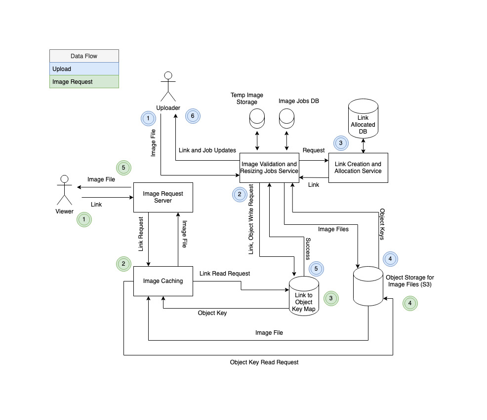

## Image Hosting

### Requirements
1. 500k uploads daily
2. 5M views daily
3. Resize and format images
4. Processing latency is acceptable

### Analysis

With 500K uploads daily and 86.4K second per day, we can expect 5.79 uploads per second.
With 5M views daily, that's 10x the amount of views so 57.9 views per second.

This load is actually very low and should generally be servicable by a single machine for normal read write requests. However, because we are accepting and processing arbitrary image files from users, we have to account for requests which use quite a large amount of space, compute, and network bandwidth. 

We do not necessarily know what size image files we will get, but we can make some estimates and do some tests on different size files. We went with testing the resize of an image file: https://commons.wikimedia.org/wiki/File:Pizigani_1367_Chart_10MB.jpg.
We tested a 2MB, 10MB, and another random file of 200KB. The image details can be found in the charts later on in this section.

We tested resizing to standard sizes of 1024 width, 800 width, and 500 width using Pillow: https://pillow.readthedocs.io/en/stable/.

Memory and CPU profiling were done in python as well using the profile and memory_profile modules.

Given these benchmarks on resize latency and memory usage, we collected the stats and calculations below.

#### File Type - JPG
| Type | File Size  | Dimensions | Mega Pixels |
| -------------| ------------- | ------------- | ------------- |
| small | 200 KB | 1200 x 800  | 1 |
| medium | 2 MB | 2560 X 1749  | 45 |
| large | 200 KB | 10315 X 7049  | 72 |

#### Memory Footprint

| Type | File Size  | Resize Memory | QPS | Mem For Files | Mem for Resize | 
| ----------- | ------------- | ------------- | ------------- | ------------- | ------------- |
| small | 200 KB | 10 MiB  | 6 | 1.2 MB | 60 MiB | 
| small | 200 KB | 10 MiB  | 10 | 2 MB | 100 MiB | 
| small | 200 KB | 10 MiB  | 100 | 20 MB | 1 GiB | 
| medium | 2 MB | 50 MiB  | 6 | 12 MB | 300 MiB | 
| medium | 2 MB | 50 MiB  | 10 | 20 MB | 500 MiB |
| medium | 2 MB | 50 MiB  | 100 | 200 MB | 5 GiB |
| large | 10 MB | 500 MiB  | 6 | 60 MB | 300 MiB  |
| large | 10 MB | 500 MiB  | 10 | 100 MB | 500 MiB  |
| large | 10 MB | 500 MiB  | 100 | 1 GB | 50 GiB  |

#### Network Throughput
| Type | File Size  | Network Speed | File Read/Write Latency | Network Throuhput |
| --------- | ------------- | ------------- | ------------- | ------------- | 
| small | 200 KB | 1 GigaBit Per Second | 2 ms | 500 per second |
| small | 200 KB | 10 GigaBit Per Second | 200 usec | 5000 per second |
| medium| 2 MB | 1 GigaBit Per Second | 20 ms | 50 per second |
| medium| 2 MB | 10 GigaBit Per Second | 2 ms | 500 per second |
| large | 10 MB | 1 GigaBit Per Second | 100 ms | 10 per second |
| large | 10 MB | 10 GigaBit Per Second | 10 ms | 100 per second |

#### Processing Throughput on single core
| Type | File Size  | Img Resize Latency | Img Resize Throughput | Processing Latency | Processing Throughput |
|-------| ------------- | ------------- | ------------- | ------------- |  ------------- | 
| small | 200 KB | 10 ms | 100 per second | 40 ms | 25 per second |
| medium | 2 MB | 50 ms | 20 per second | 200 ms | 5 per second |
| large | 10 MB | 500 ms | 2 per second | 2 s | .5 per second |

#### Storage HDD - 
1 Year 200M records -  b-tree has 6 levels with 50 degree fanout
100 disk seeks per second || 30ms read/write for 1MB || 
| Type | Size  | seeks | read/write latency | throughput | bottle neck |
|-------| ------------- | ------------- | ------------- | ------------- |  ------------- | 
| small img | 200 KB |  7 | 6 ms | 14 per second | seeks |
| medium img | 2 MB | 7 | 60 ms | 14 per second | seeks |
| large img | 10 MB | 7 | 300 ms | 3 per second | read/write throughput |
| link - key mapping | 200 bytes | 7 | 6 usec per second  | 14 | seeks |

We can see that, even if we expect to process large 10MB files with 70 MegaPixels, we can comfortably process 10 requests with Gigabit networking bandwidth and 100 requests with 10 Gigabit bandwidth. This is well above our average 6 requests per second, and we get ten times as much throughput with a more reasonable and typical 1MB file.

Similarly, even if we expect to process 100 extremely large files, our memory footprint only reaches around 50 GiB, well within the capacity of a typical large machine with 64GB.

Storage wise, it's quite ordinary to expect such a large volume of items. Estimating the 3 files to be about 2MB total, we would need to store about 365 Million MB per year. So about 365 TB. Depending on the size of disks, we would need 100  disks for 4 TB disks. Evenly spread, we could expect our read write throughput to be in the thousands per second. This is well above our expected requirement of 6 writes and 60 reads, and could accomodate 100 writes and 1000 reads fairly easily, given we have enough cpu cores to match the disk volume we are using. Furthermore, it seems very simple to scale this horizontally and simply add more machines as we accumulate more data over the years.

The main bottleneck we should expect in this process is compute. For a large file, we estimated it would take 500ms to resize the large 10MB file on a single core. Since we expect to resize it to 3 different standard sizes, we get a 3x latency of 1.5 seconds. And we can round up to 2 seconds for buffer and accounting for other minor processing tasks like loading and validation. This means we need two cores to achieve a throughput of 1 per second. And we need 12 to accomodate for the load of 6 uploads per second. Still within the capabilities of one machine, but once we scale up to larger volumes of requests, say 100 per second, we will need 200 cores, and most likley on the order of tens of machines.

Luckily, we can reason that we only need to process more typical files of 1 or maybe even 2MB. This is 10x faster than the large 10 MB file and brings our latency down to 50ms for resize, 200ms for total processing. At least we can push out 5 uploads using a single core, and about 80 using a 16 core machine. 

In all cases though, the processing throughput for a single and even 16 core machine is much lower than the throughput for our network bandwidth or memory capacity. Thus we can comfortably assess that for any load, as long as we are scaling up enough cores the resize compute load, we should have enough machines and capacity to handle the uploads. 

Under our initial assessment, one 16 core machine with 10 Gigabit network bandwith and 64 GB memory would be more than enough. But we could easily add more as loads scale without any issue.

### Design and Components

These components should handle our image hosting site nicely.

1. Image Validation and Resizing Service
2. Link Creation and Allocation Service
3. Image Request Service
4. Image Caching Service
5. Link to Object Key Map
6. Object Storage (S3)

 

#### Image Validation and Resizing

As we have described in our Analysis section, we only need a few machines with standard but appropriate amount of cores to handle the load of uploads we expect and more. We expect requests to come in with the 1 MB file size on average. We then read the file type and file to check that it is not too large (decompression bomb) and that it is a valid file of the given type. This protects us against an malicious image files. Then we can go on processing.

In order to be extra safe and user friendly, we can attach small but fast storage to write the image files and job processing data. This adds only a slight overhead. We can either scale out this service or use SSDs to improve if necessary. Nice thing is, we only need enough storage to account for currently processing jobs and files (only 10-100 per second), then we can reclaim the storage for new jobs.

If we like, we can also interact with a separate user database and create another service which allows users to see their job history and statuses. Seems simple at the given loads.

#### Link Creation and Allocation Service

As we need a unique link for every image uploaded, we should have a fast and efficient service we can create unique links for us. We can do this using a small service which uses bitmaps to large blocks of pre-generated links. Essentially we can create one to one mappings of ints to links with some determinisitic algorithm (i.e. 0 = domainurl.pic/aaaaaaaaaaaaa, 1 = domainurl/pic/aaaaaaaaaaab, etc.) Then we can use roaring bitmaps to track very large blocks and urls within the block.

This should allow us to easily keep thousands of available links in memory to hand out to requesters.

100 byte link, 64K links bitmap is 8 * 1000 bytes = 8K
Only need 10KB memory. Can calculate url on the fly with number.
May need to be careful with locking to make sure there isn't too much conflict over the same urls. However, should easily service thousands of requests per second. 

#### Image Request Service

Simple service. 
Functions:
1. Parse Links
2. Determine if link is valid (with bitmap maybe)
3. Request file from Image Cache or Image Storage Service if Cache Miss

##### Considerations:
Memory: Not an issue. Small footprint. Links are less than 100 characters. Requests are only 1KB if we include metadata.
Network Bandwidth: Same as above.
Compute: Parsing and forwarding is super fast.

#### Image Caching Service
The more memory the better. But memory is expensive at the scale we are storing.
1 year is about 365 TB. 512 GB for one year dedicated amazon about $20k
not clear that we would really get much benefit from caching as we need scalable storage anyway and are serving only hundreds of requests per second. With hundreds of machines for storage we could probably just get away with serving straight from disk.

Possible improvements: 
Keep hit count. Only cache anything which hits above 10. Tune expiration parameters so only most frequent hits get cached.
It's possible we could tune the caching system with memory, SSD, HDD, and further levels of archived storage. Would add complexity to checking the various levels of cache. but could potentially save us lots of money.

#### Link to Object Key Map

DB Instance which stores Link and Object key in object storage. Can use any sql storage like postgres or mysql. Not too interesting.

options: store diff size images separately or all together.
Doesn't seem to matter too much. May add latency to the processing service when adding all together, but saves on constanst factor blow up of index and b-tree. Would rather just process all and add together.

#### Object Storage
Needs to handle 100s of writes of image files and consistent object key replication. It's possible to build something like this using linux and some sql implementation. However, S3 works really well and costs less $100K for 365 TB (1 years worth) of storage. Since, it's about the same costs as an underpaid developer for this type of work, it seems worth it to just use S3 and get all the additional benefits that come with it. 
On the other hand, if we use some open source software, we could save tons of money for this service.

### Scaling
All these systems scale fairly easily. Only the various databases would need some coordination on which nodes which partitions as they grow. However, only the object storage would blow up very much because of it's need for so many disks. The other services only require a few standard machines and another order of magnitude would only be in the tens.

### Replication / Availability
Single leader is simplest. It only adds latency for as many synchronous replications it makes, But this is fairly acceptable because the user expects to wait a few seconds to process their image anyway. Using this strategy it shouldn't be hard to switch to follower nodes when there is an accident, and just let the former leader know when it comes back online.

Another option is to have a leaderless, Dynamo type system. We might add a lot more complexity and latency at times when nodes get cut off or fail. We might also find consistency errors when nodes are lost and come back online. However, we can probably absorb that in a reasonable error budget.

Recommendation: Single leader with one or more synchrous followers. 
Reasoning: simple and latency is expected at write time anyway. So we don't upset users with write latency and we can minimize downtime on the leader going down since it costs essentially nothing to switch to the follower and then let the former leader know it needs to become a follower on rejoining.

Replication complication: replicating the job and link statuses could be slightly complex. But we can simply do checks, restart jobs, and throw away unused links to accomodate.

### Latency

The majority of latency for an upload is dominated by the resizing and writing of the image files. It takes about 200ms to finish the resizing process. And it takes about 60ms to write 2MB of image file for an average request.

Including the 5 or so network hops we are doiing (an additional 2.5 ms in a data center) that's less than 300ms to do all the processing. We can add an additional 150ms latency to get to and from the user. 450ms is quite fast for the overall process we expected. As we were initially given a 10s buffer, it doesn't really matter how much extra time the other services take processing and writing even though we expect them to be negligible in comparison.

On a read we must be much faster. However, the latency is dominated by the eads to find the object key and read the file from storage. We expect about 30 ms to read a 1MB file and maybe another 30ms to read all the pages which store the link to key mapping and the object location. We can even add 100ms for ten or so disk seens. So overall under 200ms total to find the file and  read it from disk. Even if we double that time and add 150ms latency to the user it comes to about 650 ms total on average. And we get better latency for users close by and loading smaller image size. This seems well within budget.

### Other considerations
- It's expensive to buy networking equipment machines upfront. It also requires a lot of operating and maintenance costs to keep even tens of machines connected with Gigabit standard network bandwith. Furthermore, cloud service providers have better proprietary technology for processing packets and data. It seems that more than a handful of machines is not worth building yourself.
- If there is already infrastructure in place for buying and managing equipment then it could be very cheap. Otherwise probably not worth it.

