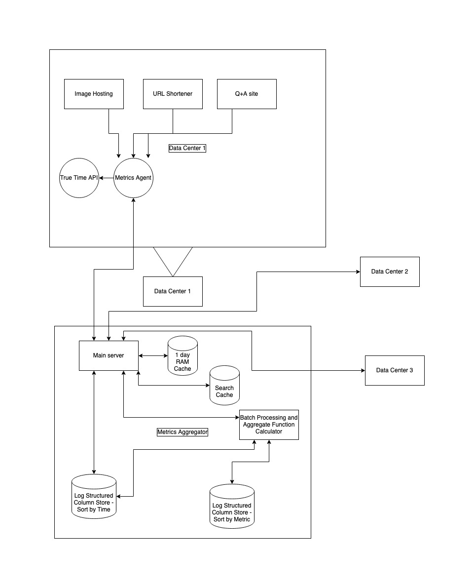

## Aggregate Metrics

### Requirements
1. Aggregate metrics across geographic zones and services
2. Support by the second granularity - meaning nodes report metrics over the time range of one second
3. Allow internal users to query for the metrics over any time range, and at set granularities
4. Allow queries to support aggregate functions: count, sum, etc.

### Summary
- Write-heavy system and data arrives mostly sorted -> Log structured storage
- Few columns, mostly analyzing one or two at a time -> Columnar storage
- Desired sort is easily compressible by column - optimized compression scheme on each column
- Recent data is more critical (accuracy and latency) -> cache 24 hours data in RAM
- Very large amount of data to analyze which comes in over a long time period, but at pre-dertimined times -> pre-process most of it so that when final set of data comes in, it can be quickly processed. And save the limited calculations so they can be quickly retrieved in the future. Also compress data stored on disk as much as possible.

### Upfront Asumptions and Decisions
We are going to have individual machines report their metrics. A machine will have some kind of interface with our metrics systems, which allows it to be aware of the metrics it needs to collect and how and where to report them. 

We will assume this type of compute on each machine is fairly negligble, and each machine can collect and report this data within a few second of the target second. As we will see, we only expect to collect tens of metrics and we only have 3 services currently. So each machine only needs a fractional computing resource each second.

We will want some kind of synchronization so we can analyze and understand our reported metrics as occuring on some relatively shared timeline. We desire the reported second to mean the same among all nodes.

In order to do this, we will install a true time system at each location. Let's assume that we are able to accomplish this with many cheap GPS clocks or one atomic clock per data center and multiple GPS clocks to support it.

This allows us to report numbers within the same second more or less. It won't be completely perfect, but we should be able to engineer the error to an acceptable enough level.

### More assumptions:
- Users will want to see extremely accurate recent information, but are not as concerned for historical information.
- We are starting off with around 30 metrics, around 5-10 as standard and 20-25 for each app, added by users. Lets say each machine can report any of 30 metrics for one app. (maybe 5-10 global ones and 20-25 unique to each app)
- from our previous analyses and system designs, we need less than ten machines total to support our current system. However, let's assume we have expanded to 3 geographic zones, so we may need 10 machines at each location.
- All metrics are some kind of number. Wheter it is an integer or float, for a single report from a node, 8 bytes should be enough to report that single metric. (we could maybe cut it down more or we can report them as a variable int, and the type will be globally decided for storage)

### Data
A metric has to be assigned an id by our system. It will determine the metrics type, processing, and storage. For now we can assume that we have it stored in some central location and all agents and nodes know about it. But we may want to consider encoding versioning and other metadata in messages as well.

Each metric reported also has a nodeId assigned. (we will assume we can handle globally assigning these for now, but we could possibly introduce a cluster id and locally assigned node id so there's less overhead for coordinating these assigments. At the moment, this seems to occur very infrequently, when a node comes online, so it seems ok to use some global system like zookeepr to assign this)

Besides the metricId and nodeId, we will use an appId to determine which service a metric belongs to. we may have global metrics that we want to breakdown by app, so it would be useful to have an appid. The alternative is to save each metric separately, and allow users to configure their groupings freely. Since it seems this is somehting we want often, we will have one byte dedicate to it. It will also help us track and group all metrics by a metricid and allow faster global processing as we will see later.

#### Metric Data 
| time |  metricId | nodeId | appID |  metric data number |
| ------ | ------ | ------ | ------ | ------ |
| 64-bit integer (8 bytes) | 16-bit integer (2 bytes) | 32-bit integer (4-bytes) | 8-bit integer (1 byte) | varint or float or other number (1-8 bytes) |

If data is 8 bytes. that's only 23 bytes total, rounded up is 24 bytes for each reported metric.

### Estimations

with 10 different machines at 3 different zones, that's 30 machines.
Each of the 30 machines can be running and reporting on one of the 3 services. And they can also report any of 30 different metrics. So 2.7k different metrics will be coming in globally every second. Rounded up is 3k metrics per second which need to be processed in our current iteration.

Each of 3k metrics is about 24 bytes. which is about 72k bytes. or around 75KB per second. If we store all like metricIds together then we reduce the size by 1/3 so each metric is 16 bytes and total is 50KB per second.

Receiving these over a Gigabit ethernet connection shouldn't be a problem. Given we can do billions of operations per second on a single core, that means we should have plenty of compute to receive, read, and process each metric. (we will go into details on the processing later)

these would be processed as the same time. maybe there are some laggards tho. Since we expect to process all of these as a bucket of seconds, we can just buffer it in memory and copy it over after quickly sorting in a few seconds later. It shouldn't take very long to sort a few thousand items. According to benchmarks, it only takes a few milliseconds to sort 64K ints.

In a day there's 86.4k seconds. ~100k. so 50KB * 100k = 5GB per day.
This is small enough to hold in memory at current levels, but an increase of a factor of 100 would mean we would need more machines. But at least it can comfortable accomadate over factor of 100-200x increase with a 1TB RAM system.

A month's worth is 30x (150 GB), and a years worth is 365x (1.83 TB). Rounded up a year's worth of data is about 2TB. 

We will be writing data constantly, but we will only have a few hundred users from the company. This means we should only see a few hundred queries from our users at any one time. We can estimate that 200 qps is the max load we can expect at any one time, and it's reasonable for users to wait a little if there is high load. Furthermore, users generally aren't closely monitoring this dashboard. There may be one or two programs that monitor the data from the metrics system, but there's no need to query even once per second, let alone multiple times per second. Thus, it seems safe to categorize this system as write-heavy.

### Design

same image as beginning of document

We will hold recent data (for now about a day's worth) in memory. This will allow internal users to quickly and easily debug current problems.

Older data shouldn't be as critical, even if we keep it on hard drives it would be okay. However, if we buy a few SSD's it would improve our write throughput a lot. Since we don't need too many replicas we can pay some money for a few SSD's.

Since our system is write-heavy it seems reasonable to desire a log structured based database. We will be writing constanctly, vs only occasional interaction with a small number of users. Further more, we have a natural sorting of our data set (by time) and the data actually arrives almost sorted anyway. This makes it really convenient to choose a log structured storage system. Furthermore, we only have a few fields on our data: time, nodeid, metricid, appid, data. And we can remove metric id by simply storing all the same metrics together. 

As mentioned before, we are going to eventually store huge amounts of data either by scaling up or accumulating over time. However, we can notice that with just a few field, we will tend to only care about a few at a time. And we will always store our data physically in order in our log structured system, and we won't care to edit or delete data. It will always be as first reported unless there is some error in the system. So given this, we can see that it would be extremely convenient to store our data columnwise. Our ordering won't change so we don't have to worry about arbitrarily moving data. And we don't even have to consider deletion. With a columnwise storing and only a few fields, we can compress our data very efficiently. As we will see, we can probably expect to compress over 100x or even more if we carefully consider the data.

At the previously mentioned a year's data should be doable with 5GB x 400 = ~2TB. This means we can easily fit a year's worth of data on a few SSD's with no compression at current levels. If we use hard drives we should be able to scale up to 100's of Tera bytes and handle our writes and reads using parallel computing and smart partitioning. (This is possible since we are mostly doing append only and merging for writes and few reads.) At current rates we are only writing 50KB per second, at 100x we would be writing about 5MB per second. Even a hard drive could accomplish this at 1MB per 30ms using a few cores in parallel.

But even though we seem to be able to store and retrieve our data by time, we still need to consider how to provide aggregate stat summaries over our data set. We mentioned that we want to support sum, count, avg, min, max, 50, 75, 90, 95, 99, and 99.9 percentiles on our data at first. The first five are easy enough to simply calculate on the fly for each granularity (second, minute, hour, day, week, month, year). But the percentiles require us to collect and sort all the data for each time period. That means we will need to sort and store all the data we've already collected. At a year's time span with 2TB of data, we will take forever to sort all the data by value.

To handle this, we will batch our data by each granularity and saved our calculations. For each second, we will sort all the data points, and store it on disk (we probably won't store the stats for each second since it would be simple enough to retrieve the raw data and re-calculate). Then at every minute, we can merge all the second data and calculate the minute stats and store both on disk.Then repeat hour, day, and so on. 

This would allow us to sort only second data (which should only takes a few millisecond at our current rate), and after that simply merge up all the data at higher granularities. With a k-way merge taking O(n*logk) time wise, and k being max 60 (log60 = ~ 6) at each granularity, we essentially are just reading the data in order and copying into larger blocks each time. A years worth of data at 2TB would take 6000 seconds to read. SO we would expect only a few hours to process a years worth of data. That seems extremely fast.

We can keep improving more by introducing compression and also prefix counts. By adding prefix counts to blocks on the sorted metric values, we can find the percentiles in logarithmic time. (we would know the full count from the end of the data and can find the 50%, 75% etc through binary search)

### Compression

By storing our data columwise, we can use a few different compression schemes to efficiently store our data.

For our original time sorted data, have data which looks like this:

#### Metric Data 
| time | nodeId | appID |  metric data number |
| ------ | ------ | ------ | ------ | 
| 64-bit integer (8 bytes) | 32-bit integer (4-bytes) | 8-bit integer (1 byte) | varint or float or other number (1-8 bytes) |

And is sorted byt time, nodeId, and appId as a multi-column key. We know that we are expecting all our nodes to report for each second and we only have 3 apps/services currently. We are reporting 3k metrics for each second. So they all have the same time data point and are all grouped together in on column. And since we expect every second to be reported, we can more efficiently store the time data as a delta and a run. one byte for the delta should almost always work (we can use varint to account for skipped seconds)
and a varint run which will usually be 3k but may be more or less. This means we only need 3 bytes to encode the time for 3k data points: a +1000x compression.

Our nodes are also fairly consistent. We expect them to report each second, and generally this set is the same. Since we they report in the same order, we expect the pattern of 3k nodes to almost always report the same pattern, with exceptions here and there. In this case, we can use a huffman or probablistic encoding to encode the same high usage pattern as a few bytes. And we can use runlength to cut it down even further. If we say the most common patterns are encoded as 1 byte on average, then 3k items only need 1 byte to encode the pattern. And if this pattern repeats often, then we can use run length. So a few bytes can encode thousands of data points once again.

With appId, it is less compressible but similar. With only 3 services, there are only 9 3 data point patterns that can exist. So if if we use one byte to encode each 3 point pattern and run-length encoding, we can compress the appid column to 1/3 it's original size at least. It seems reasonable we can expect another 3x with run length so around 10% of it's original size. On the 1 byte appId, this is still very good.

Our metric data will be harder to compress but if we use varint encoding then we can expect less than 8 bytes on average, combined with our appId of 10% of one byte. We've reduced our per second datapoint size to maybe 5-8 bytes at least. And so per second we might expect to write < 25KB no matter how much we blow up. Over one day that's only 2.5GB. Over a year, that's less than 1 TB. In the long term that's only a few TBs. And if we scale up we can probably handle up to 100x with a normal budget 100TB per year seems reasonable to handle in a small-medium sized company. More than that, entering the Petabyte range per year, might be more than we can handle. 

On the batched side, we can use varint and run length encoding to sort all our metric data, since they are sorted by the metric data field. We can drop our time data, since we will just put them into their time range buckets and we won't actually care about their original time. We can use the same appid compression as mentioned above. So we will most likely only need to worry about the node id pattern. Even if we can't compress this 4byte field. It still means we are generally only storing 4 bytes for each data point. if we compress the metric data to 2 bytes on average using a varint delta encoding and a run length encoding we get around 6 bytes on average. This leaves us with a similar storage which scales nicely as the one above. We will get <1TB of storage for the year. After which, we can save all our calculations and throw it away so we can reuse the space for the next year's batch processing.

### Search Cache

Even though we should be able to quickly grab and return items from SSD and even HDD longer storage, it would be nice to have a cache for frequent queries. And since users are often querying for data on a specific granularity and across time intervals, it would nice if our caching system kept data which was touched by multiple queries, even if the ranges are not exactly the same. So if our cache and server work together to only query for ranges which we don't already have cached, we might save ourselves a lot of work. This seems like a nice to have feature, and won't make or break our design though.

### Other Considerations
In the case that all of these are too optimistic, we can always fall back on using Resevoir Sampling. This gives us control over how much data we are storing and analyzing and should often give us reasonable insight into our data. We can trade off accuracy for more speed and space using resevoir sampling. We can use this exclusively, or we can mix it with our described approach above to return a quick and dirty estimated value before our batch processes finishes.

We can also consider cold storage for older data. This can save us on cost by a lot, though it seems we shouldn't need more than 1 or 2 TB per year.

We also could add an aggregation and allocation system for our long term data. Maybe our data science colleagues wish for a deeper analysis on our trends or performance. By implementing configurable hierarchies and groupings, we can allow custom slicing and grouping of our data so we can get a sense of how much each node or cluster might be costing or profiting us.

