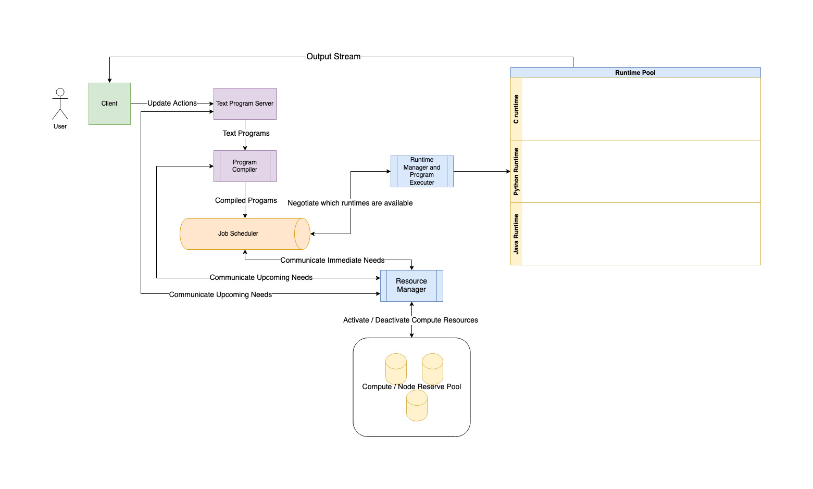

## Compute on Demand - REPL

### Requirements
1. DAU - 10% of programmers, 1% of middle/ high school students
2. Keep Latency Low
3. Limit Compute and Memory
4. Support standard library dependencies

### Summary
- Compute bound - we have some knowledge and control on how much resources each program can use, but they all must use at least one cpu to complete
- Reduce latency and overhead needed to send the program, compile, and run it
- Try to run programs using same dependencies at the same time
- Monitor and manage running programs
- Allocate machines only when needed (many down times during the day and weekdays)

### Design

The first thing noticed from our estimates is that we potentially have to do a lot of compute for users concurrently. (These number may not be entirely realistic, but let's just assume that we need to handle very high concurrent loads anyway) 

If we have hundreds of thousands of users trying to run their programs concurrently, then we will likely need hundreds of machines to execute and complete those programs with a reasonably low latency.

There doesn't seem to be any way to get around this. Maybe we can tune our scheduling algorithm so that short programs get done relatively quickly while long programs will consistenly finish in by some low factor of their expected latency. 

However, since we know that we will have very different loads depending on the time and day, we want some process which manages the number of compute resources active and on standby. This way we can save on power and other utlitities when we need less (or simply less compute used in a cloud environment)

One way we've chosen to cut down on the latency is to keep the text programs in memory while they are being edited. By buffering them and keeping them on our server machines, we need only stream the updates from the user. These updates are relatively small as are the text programs (20KB on average expected). Once the user actually decides to run it, we will already have the program ready locally, it just needs to be fed to a compiler to generate the binary/byte code (if there is any, maybe the text is ok for an interpreter.)

The next choice we've made is to compile all the program dependencies as shared libraries. Meaning users can only use standard libraries as dependencies. And they will all reference the same machine code on the machine. This saves us a lot of space and re-writing during the linking process. And we can push further preformance by scheduling programs which use the same code together, but we will leave those details to the future.

We will also re-use runtime environments when possible. Rather than spin up and tear down runtimes for each program, we will spin up and manage a pool of runtime environments, so that they can be cleaned up and re-used for any program which uses the same runtime environment.

#### Components
1. Program Buffer and Editor - Keep user program text in memory on server and stream the edits to them
2. Compiler Service - Compilation of the programs using shared libraries which are resolved at load time
3. Program/Job Scheduler - Communicates with Run time manager to schedule and and run programs.
4. Program/Job Executor and Manager - Spins up and manages different run times so there is less overhead on starting up a runtime and processes can just re-use and run on active ones. - Also monitors the run-times to see if any are using too many resources (memory or compute) and will kill and notify user if necessary.
5. Compute Resource Manager - Deactivates and Activates more machines as load goes up and down

#### Estimates
- 4 Million Programmers in US - 10% = 400K
- 30 Million - 1% = 300K

We estimate that we have about 700K DAU. Round up to 1M DAU.

Using 80/20 rule we expect that 80% of them will be active during a peak of 20% of the day. So we will have to manage a load of 800K active users during a 4 hour peak window. We expect users to run their code 10-20 times per sitting, and we don't expect more than half of the 800K users to be concurrently editing and running code.

So we have to handle maybe 16 Million jobs of running in that 4 hour window. And maybe 8 Million of those during the same hour. That's 400K code files and 2.22K runs per second at it's peak.

Each code file is estimated to be 20KB on average (2 MB when compiled to binary or byte code). If we had to all 400K of these in memory at the same time that's about 8GB of RAM. 16GB if we have to hold 800K.

If we compiled 2.22K of these programs every second, that's 4.44GB of programs that needed to be generated and loaded into memory. If they run for 10 seconds on average, that's 44.4 GB of programs which are running in memory concurrently.

Of course, it would be unreasonably to expect all these programs to run on the same cpu effectively. We expect each program should need at least one cpu, so we should be comfortable in assessing compute as our system's bottleneck.
We would need 22.2 K cpu cores to run all these programs during the peak time. (2.2K just for compiling if it take 1 second to compile each program on average)

If we assume that we use computers with 64 cores each, that's around 347 machines needed to serve peak loads (350 rounded). 

But we also realize, the extra capacity would be wasted during normal times. (school/work and on weekdays and sleep hours).

We will assume that once we compile and run a program, we will most likely throw it away.

