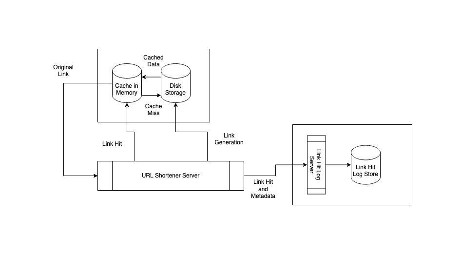

# System Design 1 - URL Shortener

## Details

### Initial Requirements
- ~10M new shortened URLs per day
- ~100 reads across shortened URL's lifetime
- Serve link hits/requests as fasts as possible (latency should be low as can be)
- Be as available as possible (up time should be as high as can be)
- Keep metada from link requests/hits

### Data 
#
#### Generate Link Request
| userid | link to shorten | metadata |
| ------ | ------ | ------ |
| 64-bit integer (8 bytes) | variable length string (assume 2KB on avg) | 500-1000 bytes |

#### Shortened Link

##### option 1:
#
| shortened-link | original link |
| ------ | ------ |
| variable length string (assume 50 bytes on avg) |  variable length string (assume 2KB on avg) |
##### option2:
#
| shortened-link | original link id  |
| ------ | ------ |
| variable length string (assume 50 bytes on avg) | 64 bit integer (8 bytes) |

| original link id  | original link |
| ------ | ------ |
|  64 bit integer (8 bytes) | variable length string (assume 2KB on avg) |

#### Link Hit Data
| shortened-link | metadata/request header/body |
| ------ | ------ |
| 64bit ( 8bytes) | variable length 500-1000 bytes (round up to 2k) |

### Analysis
We are generating about 10M links per day. On a per second basis, that's about 116 requests per second. Even if we say we might much more than this during periods of high load and traffic, it seems to safe to assume that we won't often seek spikes of over 200 requests per second, and even more true for higher rates (300, 400, 500 etc.).

Math for link generations
- serving 10M per day
- 360 s/hour * 24 hours in  day = 8.64 * 10^4 seconds / day
- 10 * 10 ^ 6 requests per day / 8.64 * 10^4 seconds per day = 11.6 * 10 requests per second on avg
We can maybe round it up to 15.0 * 10 (150) or even 500 to handle spikyness/spurtiness

We expect about 100 hits on each generated link on average. And after 2-3 years after initial generation, we won't see anymore requests for a shortened link we created. To start, we'll assume we need to serve anyone of the links we've made over the past 2-3 years. We'll start with 3 years as a high end estimate. 10 million links per day for 3 years come out to about 11 Billion unique links which might need to be serviced. 

Depending on the distribution of when links are requested, it seems there will be some bottle neck on how many links a machine can search for and service. As an exercise, we can asssume that we can put unlimited memory or disk on a single machine. If we keep the links only on one disk and assume a read for a link only takes one IO and a disk can perform 200 IO operations per second, we can serve only about 200 link requests per second. That's at a similar magnitude as link generation. 

Since we expect 100x more reads and write, that seems insufficient. We can add more disks and cores to a machine to get more access, and batch the reads so we get more hits. So if we were somehow able to get 10 links for each read and use 16 disks with 16 cores, we could raise our throughput to 32,000 reads per second for some arbitrary amount of Disk Space. 

In comparison, if we store the links in RAM, main memory references only take 100ns. If we assume one reference for a link lookup in main memory, we can perform 10M references in a second. If we add 16 cores, we can do around 160M lookups. This base magnitude increase in throughput gives us an indication that we should serve as many requests as possible from main memory. On the scale of one machine, RAM lookups outperform disk lookups by far.

So it seems we wish to keep as many of the links in memory as possible. Assuming we have 3 years worth of links (11 billion), with about 2KB data on average, we want to hold about 22TB of data in memory. If we blow that up to 40TB to account for other overhead and estimation errors, we would need about 640 machines to hold this data in memory. And we can easily scale this up and down. 

Math for link requests
- 3 * 365 = 1095 days
- 1095 * 10M = 10,950M = 11.0 B links
- disk ops / sec = 100-200
if batching 10-1 then 1000 disk seeks, 2000 IOPS
if using 16 core computer with 16 disk 32000 IOPS?
- main memory reference = 100 ns 
- 1 / 100 ns = .01 * 10^9 = 1.0 * 10^7 = 10M references per second
- 64GB / 2KB = (2 ^ 20) * (2 ^ 6) KB / 2KB = 2^26KB / 2KB = 2^25KB ~ 32M link records
- 2^36 = 64GB
40 * 2^40 = 40TB
40TB / 64GB = 40 * 2^40 / 2^36 = 40 * 2^4 = 16 * 40 = 640 machines

If we we remove the oldest links, given that we have enough room to store 2-3 years worth of links and we don't expect to see requests for older links, we should be able to keep all 3 years worth of links in memory. 

We can also archive keep all the links on disk as well. And we should in order to make sure they are persisted in case the system goes down. Since we expect to partition the data across 64GB machines, we can expect that each machine can also write the partition's data to disk. Holding 3 years worth of data, if we use a 4TB drive, we should be able to hold 64x more data on hard drive. This should be enough for almost 200 years worth of links. More than enough time to consider changes in the future. We also should be ok servicing any misses in memory from disk since we don't expect links to be hit after 3 years. 

A simple LRU Clock algorithm at a large time scale can be used for retiring the oldest data. With a little configuration I think it's reasonable to expect each node to have enough capacity to serve all read and write requests. We should also add some logging on this system which tracks misses and how much memory is being used. This way we can potentially analyze the data or use it to re-partition the data on the fly.

As far as writes go, we are only writing 10M records per day, less than 150 records per second. With 640 machines, if we assume relatively uniform distribution, we should only need to write to each machine once approximately every 4 seconds. Plenty of capacity given our previously stated disk specs. 

We may also consider how we store the data. We can store the shortened link and the original link together or separately. We may find that many links we generate target the same original link. Given that we can control the generated links to be very small, but the original link is likely to be larger, and possibly much larger, we might save a lot of space by keeping them separate. This would could potentially cut down the number of machines we need, depening on how many times large links are targeted by the same short link. But it may add a decent amount of complexity and latency for the caching mechanism. We think its safer and faster to implement the solution which simply stores the links together, regardless of repeats. If we gain insight in the future that this design would be helpful, we can use it. But it seems a waste to do extra work which may not help at the beginning.

In order to store data about the our link hits, we will keep a log. It should suffice to store the link id and the metadata in the log, which is about 1KB on the high end. In this case, we are assuming we only store successful lookups rather than random links which are not in our system, but maybe some malicious actor tried to use.

In the case, that we want to store all request, invalid or invalid, we can accomplish it with just slightly more space since short links shouldn't be too long either. 

In both cases, we can add time as a 64 bit integer and also simply append it to a disk for storage. If we are ok with sometimes losing data. Because we need to write so many requests to disk, we will be heavily constrained by our disk throughput. So we will need many machines to service very heavy loads of requests. In this case, we don't care too much about latency and reads. We will store it on disk for a while, and we can move read and structure the data at our convenience. We can also accept losing data, so we don't necessarily need a hot standby. This process takes places in isolation of the request task. 

### Components
1. Load Balancer / Server
2. Cache
3. Disk Storage
4. Hit Log

### Replication and Failure

In order to handle failure, we will use replication. We wilk replicate data within a cluster in a data center. We can replicate across nodes within a datacenter using a Dynamo style.  And we will also replicate clusters aross failure isolated data centers and geographic zones. Replication across geographic regions also has the added benefit of reducing latency on reads. We will use a single leader approach however, since we should be handle writes on a single cluster, and we place less importance on the availability of the link generation component. We can switch over to hot standby if our link leader goes down. And if both goes down, we can absorb this failure in an error budget. If this is not sufficient than we may consider using Paxos to determine new leaders and add in recovery methods for resolving conflicts when fallen nodes come back up. 

