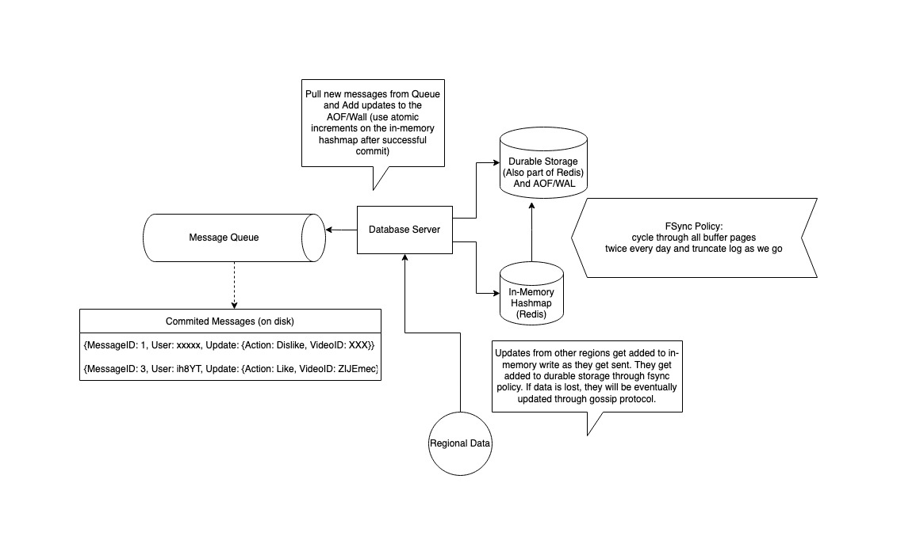
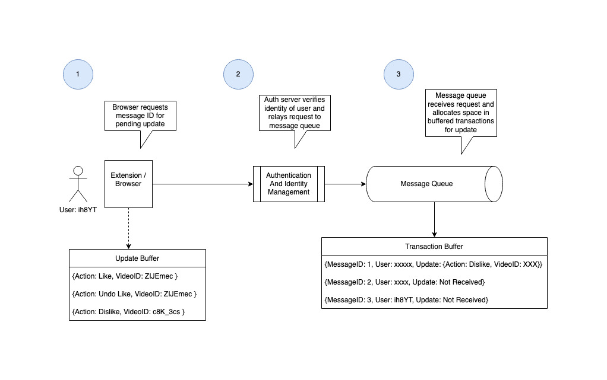
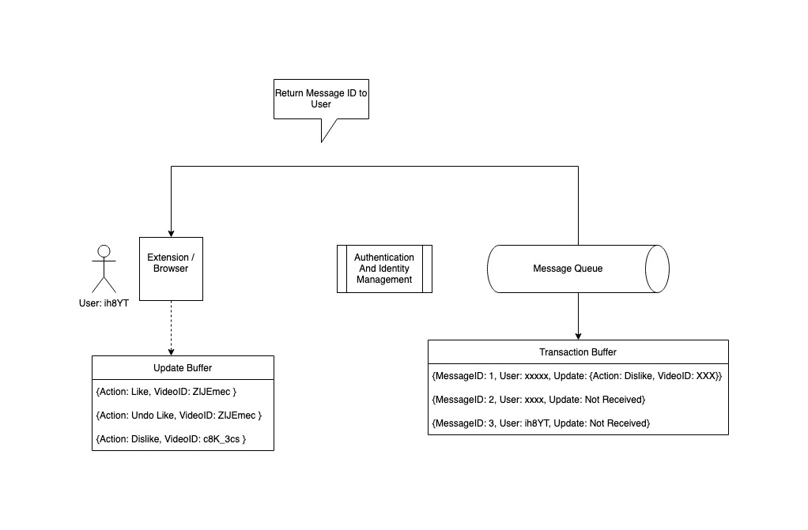
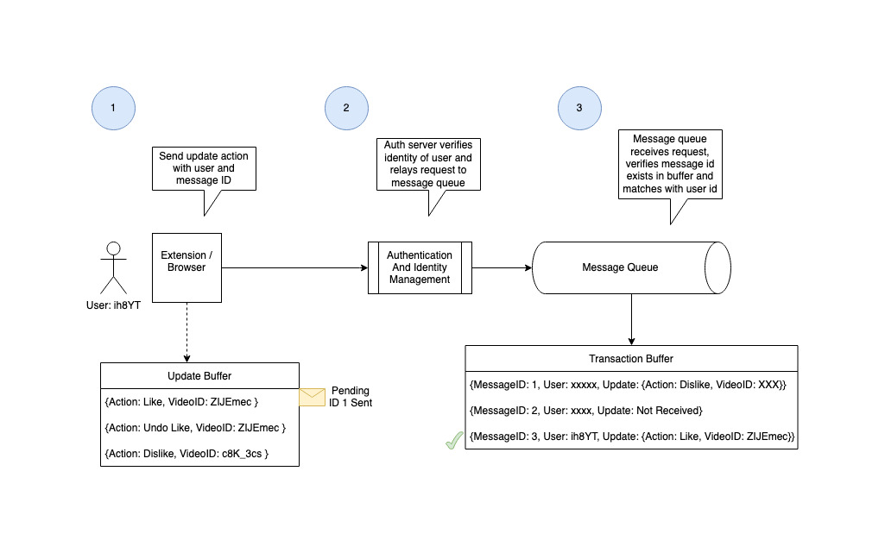
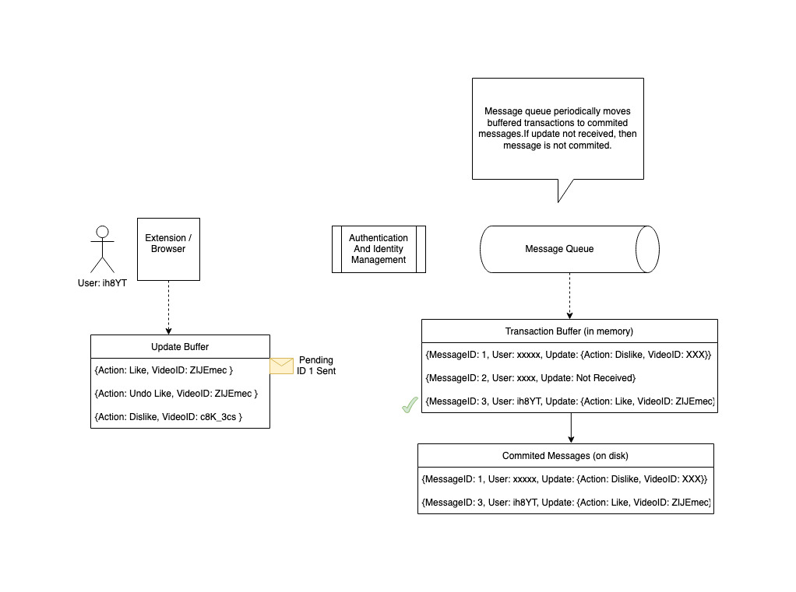
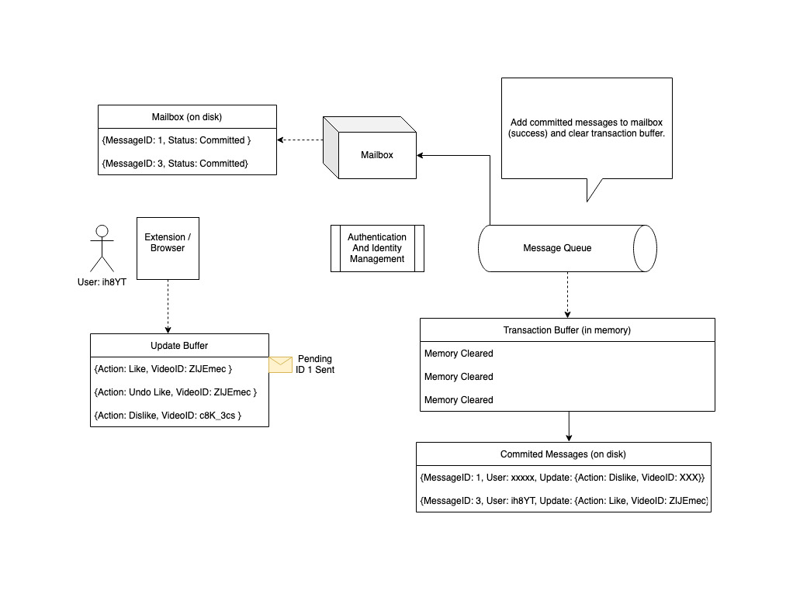
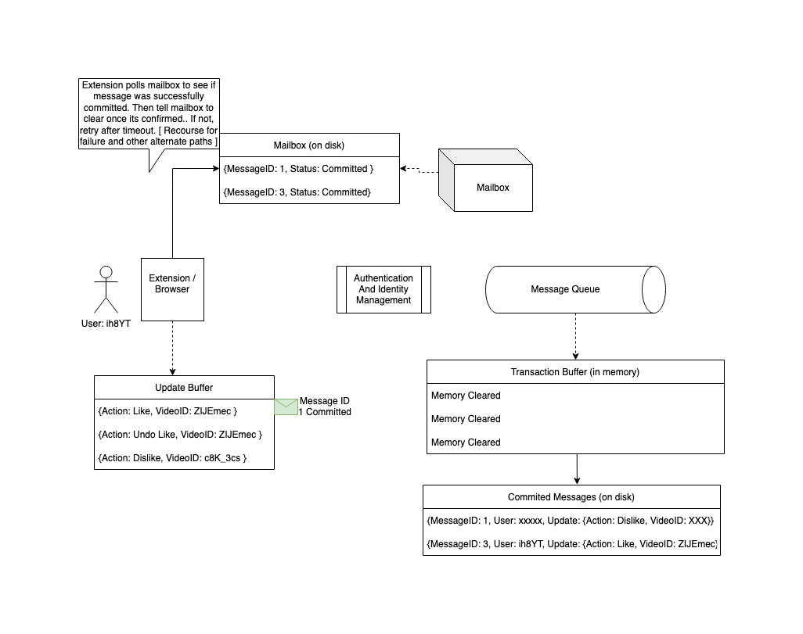
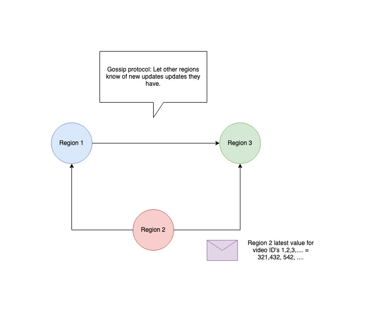

## Youtube Dislike Esitmation

### Requirements
1. Collect likes and dislikes and estimate total dislikes of page
2. Support 1 Billion users for around 30 Billion videos on youtube

### Summary
- Read-heavy, users often view a video without liking or disliking
- Read average like ratio is about 4% of views?
- 25% ratio like to views would be super elite
- Since we can't really know the like count with just our user information, we might as well give up on total accuracy from the start
- Store just the count of likes and dislikes from our users on a video
- Try to make it as correct and efficient as possible
- Use ratio of user likes to real likes to estimate true dislikes
- Since we are only keeping a count, we can probably store just a few bytes for each video id.

### Design

#### Components
1. Message Queue - for extension to load updates to so that they can be pulled by server
2. Notication Mailbox - for users to know their messages have been successfully submitted and will be consumed by the system soon
3. Redis DB hashmap of video and counts
4. Authentication/Identity Server

#### Count Data 
| VideoId |  YT likes | YT like API time | Num Count Blocks |  Counts Data|
| ------ | ------ | ------ | ------ | ------ |
| varchar (20 bytes max) | 32-bit integer (4 bytes) | 64-bit(8-bytes) | 8-bit integer (1 byte) | variable array each element having 4 64-bit integers {user likes | under like undos | user dislikes | user dislike undos} |

Each video has a number of likes from youtube API and it's update time from the YT API. It will always be updated with most recent from Youtube. (However, we would actually prefer to push this to the user, because we don't really want to hit the YT API ourselves that often, and we could save a little space). It also has an array which is a CRDT (conflict free replicated data type.) We collect the number of likes and undo likes and dislikes and undo dislikes from each user. We can easily partition these by region and not have to worry about overwriting other regional data because each region handles it's own count and gossips with the other regions. Then the total is simply the sum of all the counts.

The total size of this might be 129 bytes for five regions. We can make this 128 for now, since YT id's are only 11 bytes currently anyway.

#### Estimates
1 Billion users
30 Billion videos

With 30 Billion videos and 128 bytes data each, that's at least 3.84 TB of data we need to store.

This could fit on a hard drive of 4TB, or we could split it into 2TB SSD (or less if they have larger sizes). We could also fit it into a few TB of RAM on different machines, which is helpful for keeping data in memory.

With 1 Billion users globally we expect a third of them to be asleep at any one time. But even if we heavy concentration of users in on region, let's say we only have 800 Million users awake at one time.

If they view 10 videos in one hour (a lot), that's 8 Billion views in one hour. On a per second second basis that 8 Billion / 3600 = 2.2 Million views per second.

Since we have some control over the extension and are queueing and buffering the updates on the client's end, we have some degree of control over our load. We can implement some type of back pressure to throttle the rate at which extensions send updates if we need to. It could interfere with the latency of receiving an estimate, but we think in general we would be willing to make that trade off.

Anyway, let's keep bumping up the load to 5 Million views per second just to ensure we can handle this high load scenario.

5 Million views per second is quite a lot, but seems more or less manageable with a few machines. However, since we are serving users globally, it would be nice to reduce the latency as much as possible. It would be pretty annoying for users who are very far from the server, have very high latency. And it poses a greater risk to keep all the servers in on region anyway. 

Plus, since we are only keeping counts, and estimation is a fairly error prone goal in the first place, it seems like allocating dedicated servers for each region would be an acceptable trade off of latency over consistency. 

If we assume that we're spreading this over 5 regions and maybe two regions are double two others, then we might expect that one region experiences 1.5 M views per second at high load in our most popular region. So we want to support 1.5 M views in one region, with a proportional amount of writes based off of user likes/dislikes. 

It seems the average like/dislike is around 4% of views anectdotally, but let's give 20% just to be safe (an because we can). So we need to process 300K updates per second in one region potentially. [https://programminginsider.com/which-is-more-important-youtube-views-or-youtube-likes/] [https://pixelvalleystudio.com/pmf-articles/4-key-youtube-channel-statistics-and-how-to-calculate-them ] [ https://pex.com/blog/analysis-of-user-engagement-videos-worlds-biggest-social-sites/ ]

That means up to 300k writes to the queue and 300k writes to the notification mailbox and 300k writes to the count database per second at high load. With 1.5M reads from the Count DB.

### RAM-DB hashmap / Redis

In order to serve the reads, each region needs to keep a count of all the likes/dislikes on the videos. As mentioned at the beginning of the section, the total size of all 30 billion videos with 128 bytes of id and count data is about 3.84 TB. If we add some extra overhead for the map structure then we can probably round the total size of the structure to around 4 TB. 

We can fit this on one large harddrive or a few large SSDs, or a few machines with large TB level RAM. The issue is if can we serve all the potential 1.5M reads from each of these media. If we store on hard drives, which say have 200 IOPS, then we would need over 5K disks to support that many reads anyway. In order to reduce the amount of disk seeks needed we would need to keep the majority of data in memory anyway. SSD's seem like a better bet. If we assume that it has 600K IOPS and hashmap seeks are essentially 1 IO, then we would still need 3 of these disks to support all our IOs. We can reduce this number by having huge RAM to support most seeks in memory. Still we would need 2-3 2TB SSD's to support the size of the mapping, and would have to hope that the majority of accesses are cached in RAM to prevent disk seeks and constantly writing and wearing out the SSD. This would likely be the most cost efficient configuration since SSD's and RAM are relatively cheap compared to CPU's. 

However, I think the simplest to understand and maintain would likely be a configuration of 4-5 machines with TB RAM that partition the data set between them and have a matching 1-2 TB drive (SSD or HDD) to write an append only file / write ahead log for durability, and also fsync to occasionally. Using this configuration we spend a little for two more machine with big RAM in each instance, but we can use an fsync policy which controls how much writing we will do. This makes maintaining and predicting the lifespan of our drives much easier, and also protect us from bad caching performance. Both configurations seem reasonable to me, but I like that the all-memory configuration has more predictable performance and less concern about unexpected drive failuers (and a global service which is concerned with 2-4 more machines per region seems overly stingy), so we will continue using that one for now. (if the drives are maintained by a cloud service and we don't pay per write or read, then the drive centric configuration may be a better option)

If we assume that the reads are spread fairly evenly across the partitioned data, that's about 300-400K request per machine per second at the high load mentioned. Each request is 1KB long (a few bytes video id plus 500-1000 bytes metadata). On a 10 Gigabit/s network, we should be able to handle 1 million of these per second. So it seems network bandwidth won't be the bottle neck. Plus, by adding a second set of machines in each region, we should halve the requests to each machine. (We can replicate the machines in each region and have them both grab updates from the queue without having to wait for each other, once again ignoring consistency between the two. Users may see differences between the two if they keep pulling new view counts, but generally the two will be in sync and users might think that people have undone their dislikes or something to lower the count. At higher counts it doesn't really change the experience that much anyway.)

Assuming the latency for an in memory lookup of the id is under 10 microseconds, then one cpu should be able to process at least 100K of these each second. Since we have 4-5 partitions, we have at least the amount of lookups we would need on one machine in a region. Plus each machine is sure to have multiple cores to increase the factor of throughput. So there should be plent of capacity to serve the reads.

An in memory data structure is awesome, but we don't want to lose our counts and state if there is a failure. We reduced the risk somewhat by replicating our database, but we would like to save the data on disk in case there is a loss of power or we need to restart our machine.

So we need to have some mechanism for writing the data to disk. And each machine holds about 1 TB of data as mentioned. 

The issue being, that we are able to speed up reads by keeping data in memory, but what but not durable writes, because we might lose our data. If we want all our writes to be durable we will be bound by our disk throughput. With just the update writes we are receiving in one geographic region, we are getting about 300K updates. Spreading it among our partitions, that's about 60-80K updates on each partition each second. This is actually within the capacity of our SSD to keep up with (downside being we may have to replace the SSD often because of all the re-writing). However, we can avoid introducing extra latency and random writes by minimizing how often we flush our data to our drive. We can make our writes durable by utilzing an append only file/write ahead log. This way we can say our write is durable (we will be able to recover from power loss or restart) without actually having to update our memory structure / DB on disk.

We still need to write to the disk occassionally, so we don't have to recover from the beginning of time and also so we can truncate our AOF/WAL.Each append write would only need to be 16-20 bytes long. The videoId, the partition, and the action (increment decrement or like/dislike, we can also have 32 bytes if we want to add yt total likes and query time, or updates from other nodes). At 32 bytes each and 100K per second, that's 3.2 Million bytes per second to write to AOF/WAL, about 3.2 MB which is very reasonable for sequential writes on drives. If we write all pages in memory twice per day in circular order, that means about twelve hours of the AOF/WAL will build up. 3.2MB/sec * 3600 seconds per hour * 12 hours = 138,240 MB = ~140GB. That's a large amount of drive, but should be doable on our large 1-2 TB sized drive. By writing write each part of the In-Memory database twice per day it seems we reduce our writes and improve our latency a lot without paying too much penalty in space and data loss. Recovery could take a while, but as we have at least one replica and both instances should have the capacity to support full load by itself, it should be fine most of the time. And if use SSD, we should be able to recover very quickly (within 10 minutes with ability to read 3,500 MB/sec). 

We also have the option of applying backpressure on the extensions to stop them from sending updates. Or simply allowing queue to build up. 

### Message Queue

The purpose of the message queue component is to coordinate updates with the extensions. By assigning space and ids to a user, we are able to control bad actors and to maintain a fairly accurate count of likes/dislikes and actions.

We do this by having the extensions request a message id from the queue when they want to submit an action/update. First, the request is checked by authentication server to identify if the requester is a user on our system. Then it is forwarded to the queue. When the message queue receives the request it assigns a messageId and space in it's buffered transactions to the potential update, and returns it to the requester. It also assigns the requester's user id to the message.

At this point, the queue will buffer the transactions in memory for a short time before committing them to permanent storage where they will become an offical message that needs to be processed by the main db/count system.

When the requester receives the message id, it then sends another request to the queue with the id and the action/update to submit. The auth server verifies the requester again and forwards. Then the queue, tries to match the message id to it's buffered transactions. If the messageId exists and matches the user, the action is entered to the buffered transactions.

When buffered transactions get committed as committed messages, the queue will put status messages for each transaction in the requester's mailbox(can exist on same machine or queue system). If the requester didn't send the update in time, then the transaction is unsuccessful, else it was committed and was successful.

The requester can pull from the mailbox to see if the message it submitted or was planning to submit has been processed succefully or not. This let's the requester know if they should keep retrying to send the update, or if they need to start over and request a new message id from the queue.

If this is done carefully, user's shouldn't have a problem with redundant or lost submissions. Though there is always a chance that they lose their data and submission while it's saved in their machine's memory or they accidently clear their browser data.

If we want to be super careful, we can add some more safeguards so that user's have to keep pulling from the same queue (maybe they move regions mid submission). Or we can replicate mailbox messages which aren't cleared (checked) for a while to other regions. And use some gossip protocol to replicate and coordinate the message availablility between regions.

### Conflict-Free Replicated Data Type
With our nodes being spread across regions we would typically need a way for them to decide who is the leader and direct all the writes to that node. In this case, we have decided to use a leaderless architecture because the volume of writes is very large, the users are spread out very far geographically, and the character of our data is convenient for each node to handle writes conflict free.

Because we are only doing increments, we can make use of conflict-free replicated data types. Each node will therefore handle incrementing the count (and undo count) within their own region. This gives us the total of the region. Then they gossip among themselves so that each will eventually receive the counts of all the other regions. And the total count is simply the sum of all. 

Because it is increment only, each node knows that it simply has to update a regions count with the largest one it receives. And it is guaranteed to always move forward to the most updated state it has received. And it cannot conflict with other regions since each region only increments its assigned count.

This allows us to accept writes close to a region and reduce the latency it takes to accept and process writes. But it has the downside of short term inconsistencies between regions as they gossip to receive each other's writes. This seems to be a pretty good tradeoff since we would have inconsistincies with a single leader as well, because it would take a while to propagate changes from the leader to the followers, and estimating the true dislike can't be 100% accurate anyway.

Another issue that arises is the way inconsistincies could arise in a failed node which recovers. Because we are not logging the updates to our crdts received in the gossip protocol, some updates might be lost when the node goes down and it wasn't flushed to the drive. When it comes back online, it will have to gossip with the other nodes to receive and check the most up to date data from each region. If we're smart about it, we can keep checking with the local replica for a while before coming fully back online, only accepting data it has gossipped with other nodes about since recovery began.
, but eventually converges

